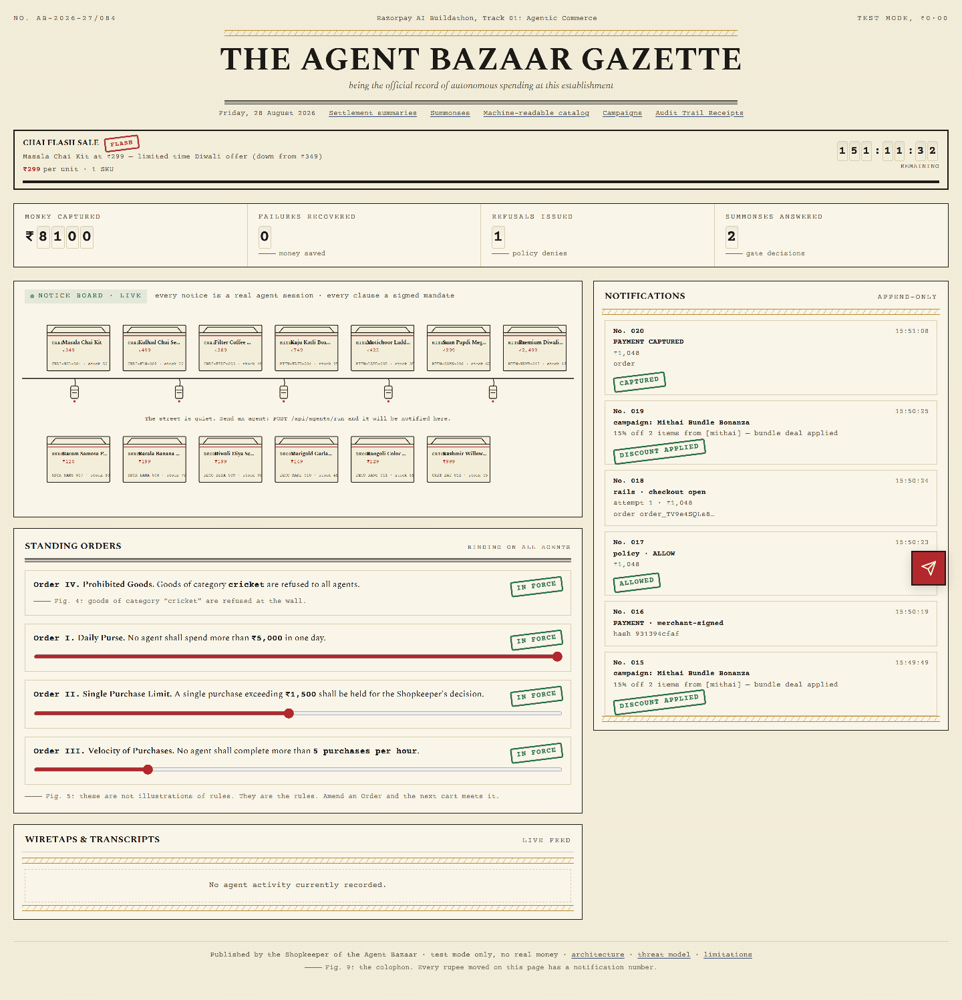

# The Agent Bazaar 🪔

**A store that real AI agents shop at — where every rupee they move is explainable, bounded and gated.**

Razorpay AI Buildathon · Track 01 · AI Growth & Agentic Commerce

> **Live demo:** https://agentbazaar-tau.vercel.app — dispatch an agent from the
> bazaar floor (Dispatch button, bottom-right), watch it shop, and settle the
> cart when the checkout modal rings.



*An agent walks into the bazaar, browses the stalls, signs a mandate, and pays — all rendered as a live gazette notification. Every rupee is explainable, bounded, and gated.*

Claude, Groq, or *any MCP client* walks into an Indian street bazaar and buys — through real
Razorpay **test-mode** rails. Every purchase drives the same road: a hash-linked Ed25519-signed
mandate chain (INTENT → CART → PAYMENT), a pure-function policy engine with hard bounds, and a
human-in-the-loop approval gate when a bound trips. All of it lands in an append-only audit ledger,
rendered live on a bazaar floor you can watch.

> **Test mode only.** The client refuses to boot without `rzp_test_` keys. No real money moves anywhere.

## Quickstart

```bash
npm install
cp .env.example .env.local   # paste rzp_test_ keys + webhook secret (or leave empty for keyless dev)
npm run setup                # migrate + seed 13 stalls & policy rules
npm run dev                  # http://localhost:3000
```

### API keys for agent providers

Set these in `.env.local` to dispatch agents from the bazaar floor:

```env
# Claude (Anthropic) — recommended for demo video
CLAUDE_API_KEY=sk-ant-...

# Groq — fast inference, good for rapid testing
GROQ_API_KEY=gsk_...
```

Both providers share the same shopping harness, tools, and policy engine.
The Dispatch Drawer lets you pick **Groq** or **Claude** with one click.

Then watch it work:

```bash
npx tsx scripts/smoke.ts                 # keyless: signed chain, deny, gate, approvals
npx tsx scripts/demo.ts                  # full story incl. real payments (needs keys)
```

## What to look at

| Surface | URL |
|---|---|
| Bazaar floor (live) | `/` |
| Campaign control room | `/campaigns` |
| Honest metrics dashboard | `/dashboard` |
| Shopkeeper's approval queue | `/approvals` |
| Receipts & audit trail | `/receipts` |
| Agent-readable catalog | `/api/catalog?format=agent` |
| MCP endpoint (point any MCP client here) | `/api/mcp` |
| Chain verification | `/api/mandates?verify=<intent>,<cart>,<payment>` |

## Agent Providers

| Provider | Model | Speed | Best for |
|---|---|---|---|
| **Claude** | `claude-haiku-4-5` | ~2-3s per turn | Demo video, complex reasoning, multi-item carts |
| **Groq** | `openai/gpt-oss-120b` | ~1-2s per turn | Rapid testing, simple purchases, fast iteration |
| **MCP** | Any MCP client | Varies | Claude Desktop, Cursor — point at `/api/mcp` |

All three share the **same** shopping harness (`lib/agents/harness.ts`), the **same** tool
implementation (`lib/tools/store.ts`), and the **same** policy engine. The only difference is
which LLM answers the tool-use calls.

From the Dispatch Drawer (`/`), pick **Groq** or **Claude** and dispatch an agent. The agent
appears on the notice board, walks the stalls, signs mandates, and triggers the policy gate —
all live via SSE.

## Conversational In-App Checkout

Every money action should feel like a **conversation**, not a redirect. When an agent proposes a
purchase, the shopkeeper sees a gazette-styled modal **on the bazaar floor itself**:

1. **Agent proposes** — the modal shows what the agent wants to buy, why, and the total.
2. **Shopkeeper reviews** — itemized cart with per-line pricing, discount breakdown if a campaign applies.
3. **Confirm & Pay** — Razorpay checkout.js opens **inside the modal** (no new tab, no hosted page redirect).
4. **Webhook fires** — payment captured, audit trail updated, receipt generated.

```
Agent calls request_checkout
  → Policy engine runs (ALLOW / GATE / DENY)
  → Razorpay order created
  → SSE event: payment.checkout_conversational
  → Modal appears on bazaar floor
  → Shopkeeper clicks Confirm & Pay
  → Razorpay checkout.js opens in-app
  → Webhook confirms payment
  → Audit trail updated
```

The hosted `/checkout/[rowId]` page still exists as a fallback for MCP clients and external flows.

## Campaign Orchestrator

Agents don't just buy — they **discover and apply promotions**. Three campaign types are supported:

### Bundle Deals
Buy N+ items from qualifying categories → X% off the total.

> *"Buy 2+ mithai items, get 15% off"* — Kaju Katli (₹749) + Laddoo Box (₹425) = ₹1,174 → **₹998**

### Flash Sales
Specific SKUs at a fixed discounted price during a time window. A live countdown banner on the
bazaar floor shows urgency levels (calm → hurry → ending soon → expired).

> *"Masala Chai Kit at ₹299 (down from ₹349) — 5 minutes only"*

### Cross-Sell
Buy from 2+ different categories → X% off the cheapest item.

> *"Buy from mithai + chai categories, 10% off cheapest"*

### How it works

1. Agent calls `list_campaigns` → sees all active campaigns with rules and time windows.
2. Agent calls `apply_campaign` → evaluates cart against campaign rules, records discount.
3. **Or: auto-applied at checkout** — when `request_checkout` runs, all active campaigns are
   evaluated and discounts applied automatically.
4. Campaign metrics appear on the dashboard: total applied, total discount given.
5. Every campaign application is logged in the append-only audit trail.

### Campaign Management

Merchants manage campaigns from `/campaigns`:

- **Create** — bundle, flash, or cross-sell with dynamic config fields
- **Edit** — update rules, time windows, discount percentages
- **Toggle** — enable/disable without deleting
- **Delete** — permanent removal with confirmation
- **Live stats** — times applied, total discount given per campaign

### Seed campaigns

| Campaign | Rule | Window |
|---|---|---|
| Mithai Bundle Bonanza | 2+ mithai → 15% off | 30 days |
| Chai Flash Sale | Masala Chai Kit ₹299 | 7 days |
| Festival Cross-Sell | 2+ categories → 10% off cheapest | 30 days |
| Diya Flash Deal | Diya Set 25% off | 5 minutes (for demo drama) |

## Docs

- [Architecture](docs/ARCHITECTURE.md) — with a Track-01-bar → implementation traceability table
- [Threat model](docs/THREAT-MODEL.md) — 13 attacks, 13 named controls
- [Limitations](docs/LIMITATIONS.md) — stated plainly
- [ADRs](docs/adr/) — SDK-over-MCP for the rail · append-only ledger · stdlib Ed25519

## Generating the Preview GIF

```bash
npm run dev                              # Terminal 1
npx tsx scripts/capture-preview.ts       # Terminal 2 — captures 6 screens

# Convert to GIF (requires ffmpeg)
ffmpeg -framerate 0.5 -i docs/screenshots/%02d-*.png -vf "scale=1200:-1" docs/preview.gif

# Or upload docs/screenshots/*.png to https://ezgif.com/maker
```

## Status

Submission-ready. All Track 01 bars met: explainable, bounded, gated, audit trail, graceful failure.
Conversational in-app checkout, campaign orchestrator, and flash sales implemented.
